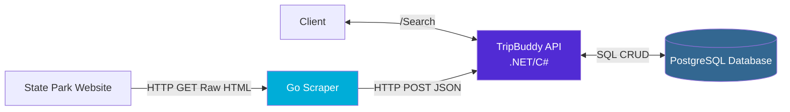

# tripbuddy-demo

## API for searching US state parks and Go web scraper to populate data

This project builds a platform for outdoor enthusiasts to find outdoor activities in their area. The main use case is to request the API `/search` endpoint with a set of starting coordinates(latitide and longitude), a travel radius, and an activity (hiking, camping, etc.). The `/search` endpoint will return state parks within the radius that offer the activity.

Currently, this project has three main components:

1. REST API build in C#/.NET
2. PostGres Database storing the park data
3. A web scraper built in Go to collect park data and write it to the API

## System Architecture



#### Data Flow

##### Scraping

1. **Go Scraper** visits state park websites and extracts park information (name, activities, address)
2. **Scraper** sends park data via POST request to the TripBuddy API
3. **API** validates and stores the park data in PostgreSQL database
4. **Database** is configured with indices to enable geographic and full-text search

##### Search

1. **Client** app requests `/Search` endpoint of API. Example : `/search?latitude=41.8789&longitude=-87.6359&activity=ski&radiusKm=1000`
2. **API** queries **Database** for parks within the search radius with matching activities
3. **API** returns results to client

## Running the App

### Prerequisites

- [Docker](https://www.docker.com/get-started/) installed on your machine
- [MapBox API key](https://account.mapbox.com/access-tokens/) (free tier available) for running the scraper

### 1. Start the API and Database

```bash
# Start the API and PostgreSQL database
docker-compose up

# The API will be available at http://localhost:8080
# Swagger docs at http://localhost:8080/swagger/index.html
```

### 2. Populate the Database with Park Data

The database starts empty. Use the Go scraper to populate it with park data:

```bash
# Build the scraper image
docker build -t tripbuddy-scraper ./go-scraper

# Run the scraper (connects to the API and loads park data)
docker run --network tripbuddy-demo_default tripbuddy-scraper
```

**Note:** Make sure you have a `.env` file in the `go-scraper/config` directory with your MapBox API key:

```bash
# Create .env file from example
cd go-scraper/config
cp .env.example .env
# Edit .env and add your MapBox API key
```

The `.env` file should contain:
```
MAPBOX_API_KEY=your_key_here
```

### 3. Query the API

Once the scraper completes, you can search for parks:

```bash
# Example: Find parks with skiing near Chicago within 1000km
curl "http://localhost:8080/park/search?latitude=41.8789&longitude=-87.6359&activity=ski&radiusKm=1000"
```

Or use the [Swagger UI](http://localhost:8080/swagger/index.html) to explore all endpoints.

### 4. Tear Down

```bash
# Stop all containers and remove volumes (clears database)
docker-compose down -v
```

---

## License

This project is licensed under the MIT License - see the [LICENSE](LICENSE) file for details.
