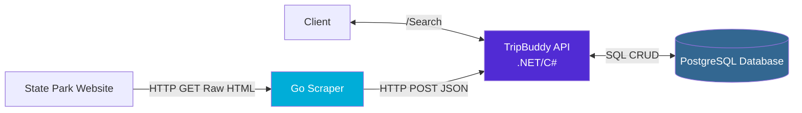

# tripbuddy-demo

## API for searching US state parks and Go web scraper to populate data

This project builds a platform for outdoor enthusiasts to find outdoor activities in their area. The main use case is to request the API `/search` endpoint with a set of starting coordinates(latitide and longitude), a travel radius, and an activity (hiking, camping, etc.). The `/search` endpoint will return state parks within the radius that offer the activity.

Currently, this project has three main components:

1. REST API build in C#/.NET
2. PostGres Database storing the park data
3. A web scraper built in Go to collect park data and write it to the API

## System Architecture

#### Data Flow

##### Scraping

1. **Go Scraper** visits state park websites and extracts park information (name, activities, address)
2. **Scraper** sends park data via POST request to the TripBuddy API
3. **API** validates and stores the park data in PostgreSQL database
4. **Database** is configured with indices to enable geographic and full-text search

##### Search

1. **Client** app requests `/Search` endpoint of API. Example : `/search?latitude=41.8789&longitude=-87.6359&activity=ski&radiusKm=1000`
2. **API** queries **Database** for parks within the search radius with matching activities
3. **API** returns results to client

## Running the App

### API and Database with Docker

1. Ensure that you have [docker](https://www.docker.com/get-started/) installed on your machine
2. **Start** the API and database in docker `docker-compose up`
3. **Open** the [API Swagger Page](http://localhost:8080/swagger/index.html) in your browser
4. Have fun!
5. **Tear Down** by running `docker-compose down -v` (the `-v` flag removes the mounted volume that stores PostGres data on your machine)
