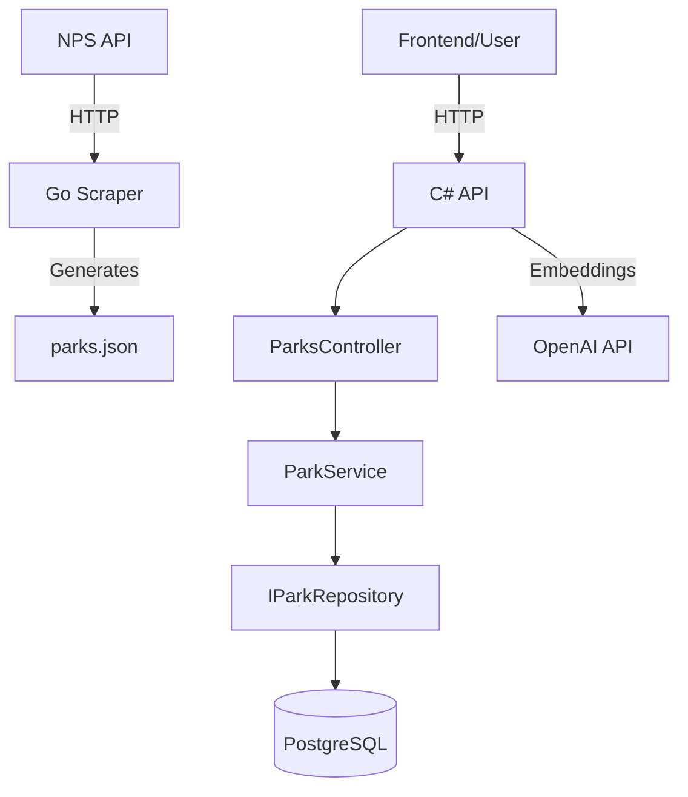

```mermaid
flowchart TD
NPS[NPS API] -->|HTTP| Scraper[Go Scraper]
Scraper -->|Generates| JSON[parks.json]

      Client[Frontend/User] -->|HTTP| API[C# API]
      API --> Controller[ParksController]
      Controller --> Service[ParkService]
      Service --> Repo[IParkRepository]
      Repo --> DB[(PostgreSQL)]

      API -->|Embeddings| OpenAI[OpenAI API]
```
