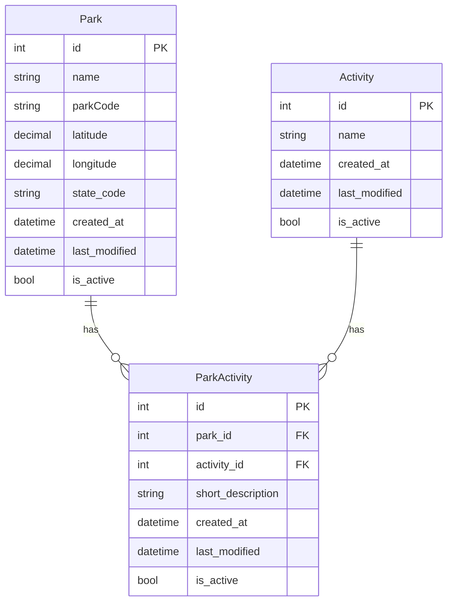

# Database Schema

```mermaid
erDiagram
    Park ||--o{ ParkActivity : has
    Activity ||--o{ ParkActivity : has

    Park {
        int id PK
        string name
        string parkCode
        decimal latitude
        decimal longitude
        string state_code
        datetime created_at
        datetime last_modified
        bool is_active
    }

    ParkActivity {
        int id PK
        int park_id FK
        int activity_id FK
        string short_description
        datetime created_at
        datetime last_modified
        bool is_active
    }

    Activity {
        int id PK
        string name
        datetime created_at
        datetime last_modified
        bool is_active
    }
```
