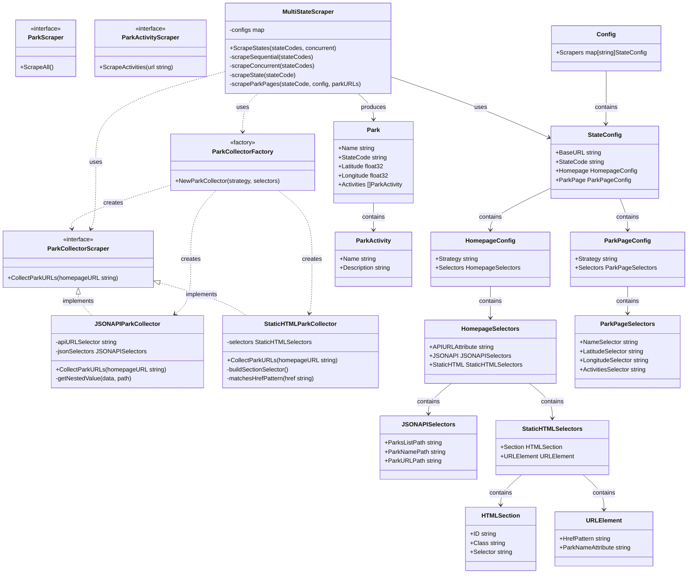

# Go Scraper Architecture

This document describes the interface structure and design patterns used in the TripBuddy park scraper.

## Architecture Diagram

## Design Patterns

### 1. Strategy Pattern

The scraper uses the Strategy pattern to support different data collection strategies:

- **JSON API Strategy** (`JSONAPIParkCollector`): Scrapes park URLs from JSON APIs
- **Static HTML Strategy** (`StaticHTMLParkCollector`): Scrapes park URLs from static HTML pages

The strategy is selected via configuration and instantiated using the Factory pattern.

### 2. Factory Pattern

`NewParkCollector()` acts as a factory function that creates the appropriate `ParkCollectorScraper` implementation based on the configured strategy string ("json_api" or "static_html").

### 3. Orchestrator Pattern

`MultiStateScraper` orchestrates the entire scraping process:

- Manages multiple state configurations
- Supports both sequential and concurrent scraping
- Coordinates between park URL collection and park detail scraping

## Key Components

### Interfaces

#### ParkScraper

Top-level interface for scraping all parks from a state.

#### ParkCollectorScraper

Interface for collecting park URLs from a homepage. Two implementations:

- `JSONAPIParkCollector` - For sites with JSON APIs
- `StaticHTMLParkCollector` - For sites with static HTML

#### ParkActivityScraper

Interface for scraping activities from individual park pages (implementation pending).

### Main Classes

#### MultiStateScraper

Central orchestrator that:

- Manages configurations for multiple states
- Supports concurrent or sequential scraping
- Delegates URL collection to strategy-based collectors
- Scrapes individual park pages using Colly

#### Configuration System

Hierarchical configuration structure:

- `Config` - Top-level, maps state codes to configs
- `StateConfig` - Per-state configuration
- `HomepageConfig` / `ParkPageConfig` - Strategy and selectors for different page types
- Various selector types - CSS selectors and JSON paths for data extraction

## Data Flow

1. **Configuration Loading**: JSON config file → `Config` struct
2. **State Selection**: User specifies which states to scrape
3. **URL Collection**:
   - Factory creates appropriate collector (JSON API or Static HTML)
   - Collector extracts park URLs from homepage
4. **Park Scraping**:
   - For each park URL, scrape details using configured selectors
   - Extract name, coordinates, activities
5. **Result Aggregation**: All parks collected into `[]Park` slice
6. **Output**: Parks saved to JSON file

## Extensibility

The architecture supports easy extension:

1. **New Scraping Strategies**: Implement `ParkCollectorScraper` interface and add to factory
2. **New States**: Add state configuration to `config.json`
3. **New Data Fields**: Extend `Park` struct and add selectors to configuration
4. **Activity Scraping**: Implement `ParkActivityScraper` interface for detailed activity extraction

## Concurrency

The `MultiStateScraper` supports two execution modes:

- **Sequential**: Scrapes states one at a time (safer, easier to debug)
- **Concurrent**: Scrapes multiple states in parallel using goroutines (faster)

Thread-safe operations using `sync.Mutex` protect shared data structures during concurrent execution.
