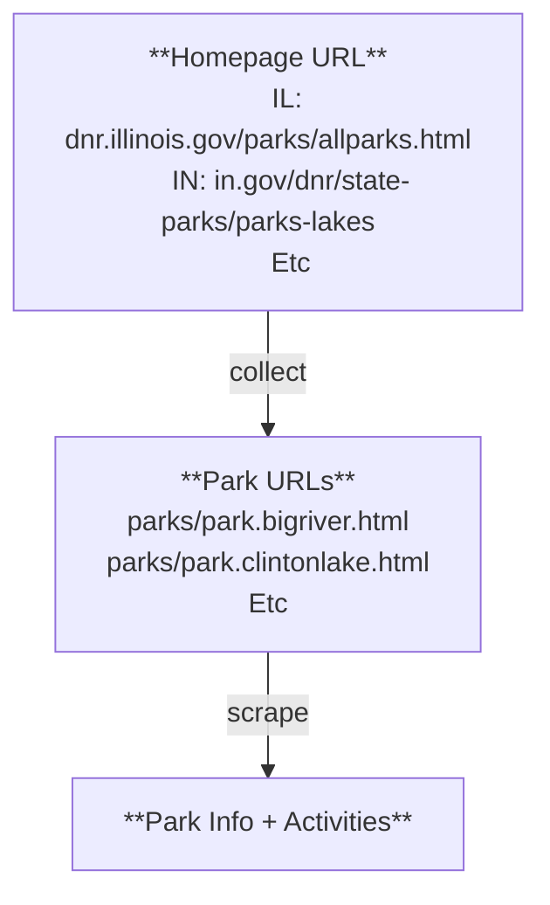

## Web Scraper Conceptual Flow

```mermaid
flowchart TD
      Homepage["**Homepage URL**
      IL: dnr.illinois.gov/parks/allparks.html
      IN: in.gov/dnr/state-parks/parks-lakes
      Etc"] -->|collect| Parks["**Park URLs**
      parks/park.bigriver.html
      parks/park.clintonlake.html
      Etc
      "]
      Parks -->|scrape| Info[**Park Info + Activities**]

```
