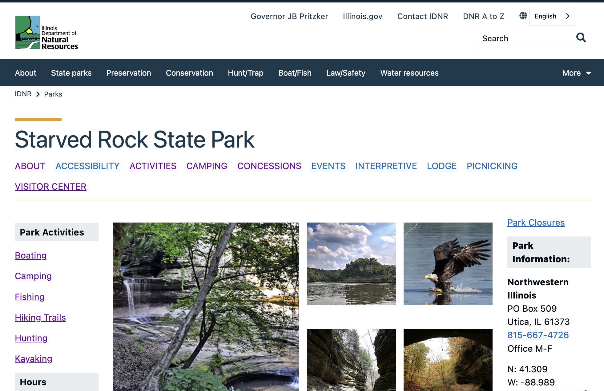
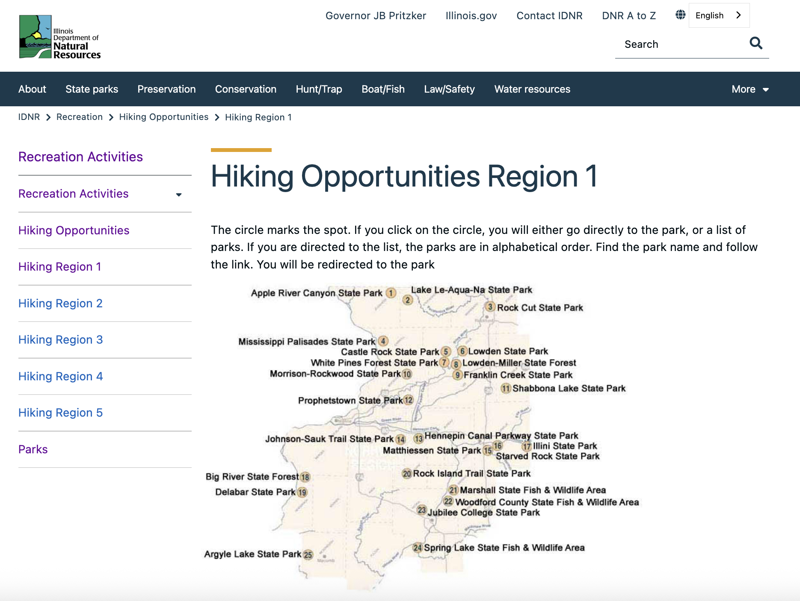
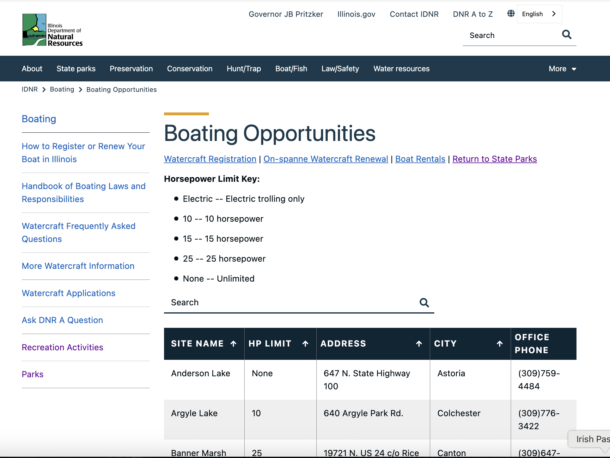
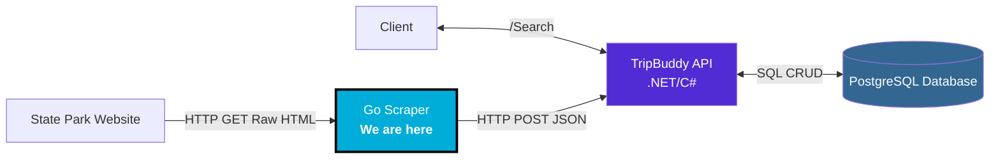
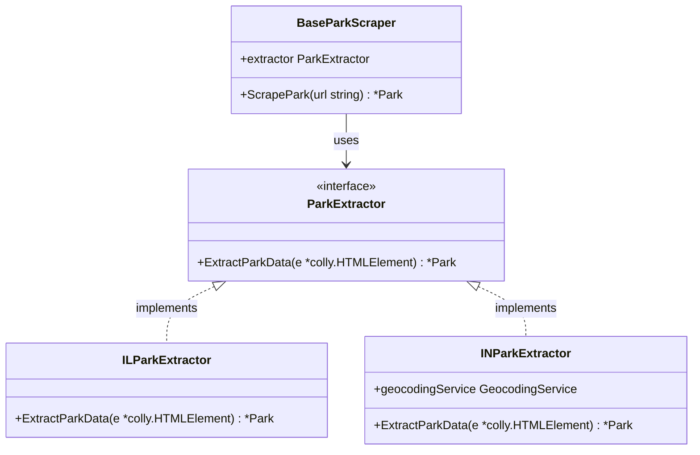

# Go Software Design Patterns

## Building a State Park Web Scraper

**Nathan Gartlan**
November 6, 2025

---

## The Problem

Finding outdoor activities across multiple state park websites

<table>
  <tr>
    <td></td>
    <td></td>
    <td></td>
  </tr>
</table>

**Goal:** Scrape park data → Store in searchable database

---

## System Architecture



---

## Why Go for Web Scraping?

✅ **Fast compilation** - Quick iteration during development
✅ **Single binary** - Easy deployment (Docker, no dependencies)
✅ **Good Scraping Library** - `github.com/gocolly/colly`
✅ **Strong concurrency** - Goroutines for parallel scraping
✅ **Type safety** - Catch errors at compile time

---

## Pattern #1: Strategy Pattern (1/4)

**Problem:** Scraping park pages from different domains requires knowledge of different structures and data.

**Latitude Illinois State Parks HTML Structure**

```html
  <div cmp-contentfragment__element--parkLatitude">
      <dt class="cmp-contentfragment__element-title hidden"> Park Latitude </dt>
         <dt class="cmp-contentfragment__element-title hidden"> Park Latitude </dt>
        <p class="cmp-contentfragment__element-value paragraph">41.309</p>
  </div>
```

**Address in State Parks HTML Structure**

```html
<p>
  <strong>Address:</strong>
  <br />1600 N. 25 E. <br />
  Chesterton, IN 46304
</p>
```

---

## Pattern #1: Strategy Pattern (2/4)

**Solution**: Create an interface that abstracts the specific details of scraping a park



---

## Pattern #1: Strategy Pattern (3/4)

### Implicit Interfaces in Go

**Interface in Go**

```go
type ILParkExtractor struct {
}

func (s *ILParkExtractor) ExtractParkData(e *colly.HTMLElement) *models.Park{...}
```

**Interface in Java**

```java
public class ILParkExtractor : ParkExtractor{
    public models.Park ExtractParkData(colly.HTMLElement e){...}
}
```

---

## Pattern #1: Strategy Pattern (4/4)

### Implicit Interfaces: Pros & Cons

<div style="display: grid; grid-template-columns: 1fr 1fr; gap: 20px;">

<div>

**Pros ✅**

- **Small Interface** design encoraged. Only require a few methods
- **Flexibility** : Use structs from external packages that implement the interface methods
- **Refactoring** : If you need an interface and already have concrete types that satisfy the interface, you don't need to modify those types to explicitely refer to that new interface

</div>

<div>

**Cons ❌**

- **Less Explicit**: It's less clear to the developer if a class in fact implements an interface

</div>

</div>

**Bottom Line** Tough to get used to, clearly offers functional code advantages

---

## Pattern #2: Observer Pattern

**Problem:** Scraper shouldn't care about persistence logic

**Solution:** Publish events when parks are scraped

```go
// Scraper publishes events
publisher.Publish(ParkScrapedEvent{
    Park:      park,
    StateCode: "IL",
    URL:       url,
    Duration:  elapsed,
})

// Subscribers handle persistence
type ParkEventSubscriber interface {
    OnParkScraped(event ParkScrapedEvent)
}
```

---

## Observer Pattern Architecture

```
┌─────────────────┐
│   Scraper       │
└────────┬────────┘
         │ scrapes park
         ▼
    ┌────────────────────┐
    │ ParkScrapedEvent   │
    └────────┬───────────┘
             │
             ▼
    ┌────────────────────┐
    │ EventPublisher     │ (buffered queue)
    └────────┬───────────┘
             │
             ├─────────────────────┐
             ▼                     ▼
    ┌────────────────┐    ┌────────────────┐
    │ JSON Writer    │    │  API Client    │
    └────────────────┘    └────────────────┘
```

---

## Observer Pattern Benefits

✅ **Decoupling** - Scraper doesn't know about storage
✅ **Async Processing** - Events processed in background
✅ **Extensibility** - Easy to add new subscribers
✅ **Testability** - Mock subscribers for testing
✅ **Performance** - Non-blocking scraping

---

## Pattern #2: Factory Pattern

**Problem:** Different states have different HTML structures

**Solution:** Factory creates state-specific scrapers

```go
type StateParserFactory interface {
    CreateStateParser(stateCode string) StateParser
}

// Get the right parser for each state
parser := factory.CreateStateParser("IL")
parks := parser.ParseParks(html)
```

---

## Pattern #3: Goroutines & Channels

**Concurrency** for scraping multiple states/parks

```go
// Process multiple states concurrently
var wg sync.WaitGroup

for _, state := range states {
    wg.Add(1)
    go func(stateCode string) {
        defer wg.Done()
        scrapeParksByState(stateCode)
    }(state)
}

wg.Wait() // Wait for all goroutines
```

---

## Real-World Example

**Event Structure:**

```go
type ParkScrapedEvent struct {
    Park      models.Park
    StateCode string
    URL       string
    Duration  time.Duration
    Timestamp time.Time
}
```

**Publisher with buffered queue:**

```go
publisher := events.NewParkEventPublisher()
defer publisher.Close()

jsonWriter := writers.NewParkJSONWriter("output")
publisher.Subscribe(jsonWriter)
```

---

## Demo Time

Let's see it in action!

```bash
# Start the system
docker-compose up

# Run the scraper
docker run --network tripbuddy-demo_tripbuddy-network \
  tripbuddy-scraper

# Query for parks
curl "http://localhost:8080/park/search?\
latitude=41.8789&longitude=-87.6359&\
activity=ski&radiusKm=1000"
```

---

## Key Takeaways

1. **Observer Pattern** - Decouple scraping from persistence
2. **Factory Pattern** - Handle different HTML structures per state
3. **Goroutines** - Concurrent scraping for performance
4. **Standard Library** - Go's `net/http` is powerful
5. **Type Safety** - Structs and interfaces prevent bugs

---

## Resources

**Code:** [github.com/nathangartlan2/tripbuddy-demo](https://github.com/nathangartlan2/tripbuddy-demo)

**Documentation:**

- `go-scraper/README.md` - Full implementation details
- `go-scraper/OBSERVER_PATTERN.md` - Observer pattern deep-dive

**Questions?**

---

# Thank You!

**Nathan Gartlan**

Ready to explore the code?
