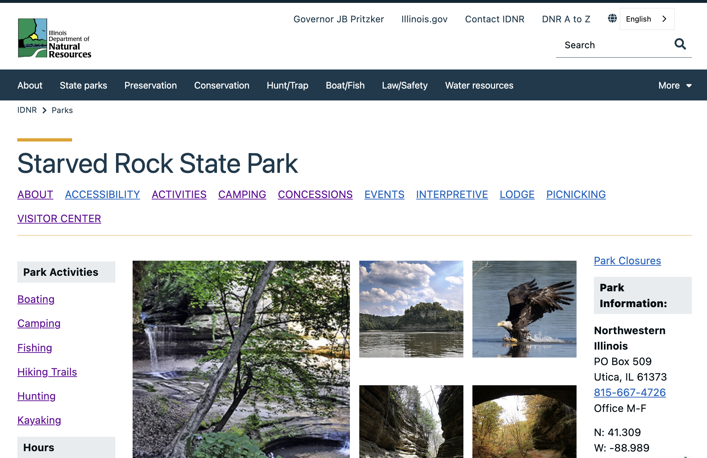
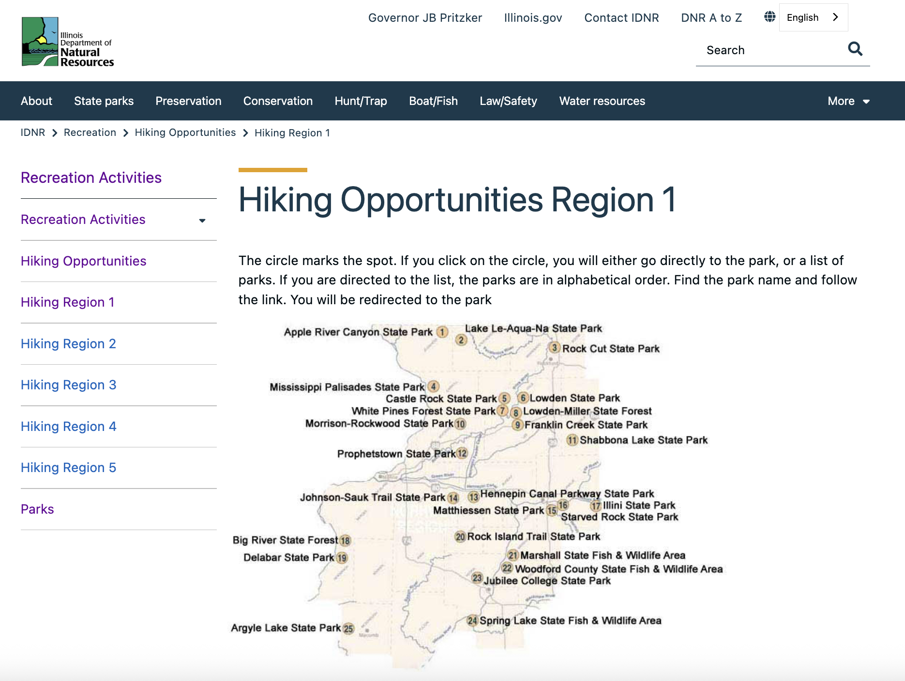
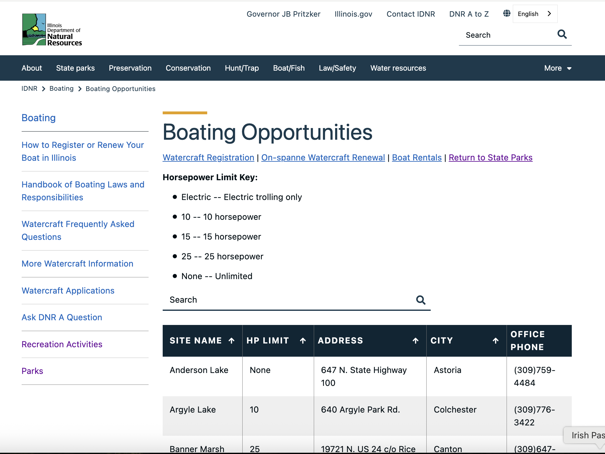
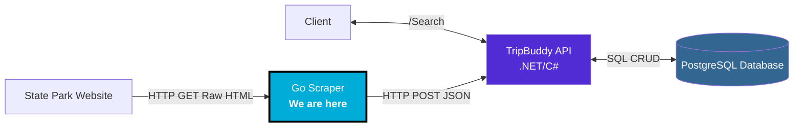
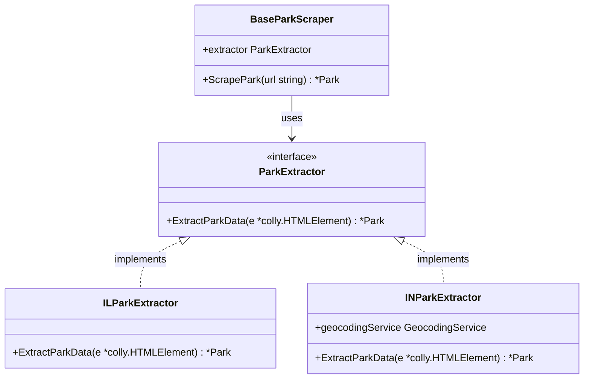
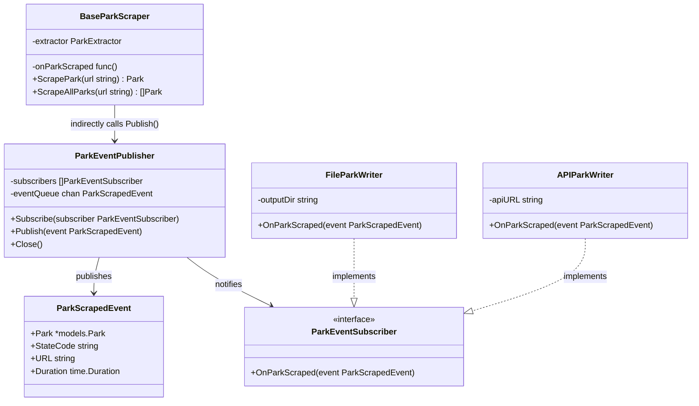
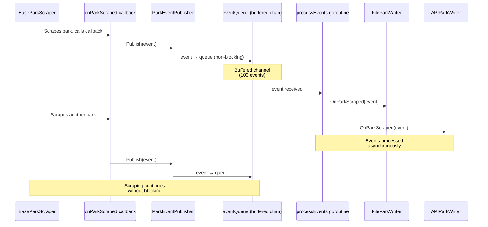

# Go Software Design Patterns

## Building a State Park Web Scraper

**Nathan Gartlan**
November 6, 2025

---

<details>
<summary><h2>About Me</h2></summary>

<table style="white-space: nowrap;">
  <tr>
    <td></td>
    <td></td>
    <td></td>
  </tr>
</table>
<ul>
    <li>Recently returned from a 6 month career break to live in London and travel</li>
    <li>6 years development experience in C#, JavaScript, and Python</li>
    <li>Currently open to my next career opportunity</li>
    <li>I'm a Go Padawan!</li>
</ul>

</details>

---

<details>
<summary><h2>The Problem</h2></summary>

Finding outdoor activities across multiple state park websites

<table>
  <tr>
    <td></td>
    <td></td>
    <td></td>
  </tr>
</table>

**Goal:** Scrape park data → Store in Searchable API

</details>

---

<details>
<summary><h2>System Architecture</h2></summary>


```mermaid
flowchart LR
    A[State Park Website] -->|HTTP GET Raw HTML| C[Go Scraper<br/> <b>We are here</b>]
    B[Client] <-->|/Search| E[TripBuddy API<br/>.NET/C#]
    C -->|HTTP POST JSON| E
    E <-->|SQL CRUD| F[(PostgreSQL Database)]

    style C fill:#00ADD8,color:#fff,stroke:#000,stroke-width:3px
    style E fill:#512BD4,color:#fff
    style F fill:#336791,color:#fff
```

</details>

---

<details>
<summary><h2>Why Go for Web Scraping?</h2></summary>

1. **Fast compilation** - Quick iteration during development

2. **Single binary** - Easy deployment (Docker, no dependencies)

3. **Good Scraping Library** - `github.com/gocolly/colly`

4. **Strong concurrency** - Goroutines for parallelism/async operations

5. **Type safety** - Catch errors at compile time

</details>

---

<details>
<summary><h2>Pattern #1: Strategy Pattern</h2></summary>

**Problem:** Scraping park pages from different domains requires knowledge of different structures and data.

**Illinois State Parks Latitude HTML Structure**

```html
  <div cmp-contentfragment__element--parkLatitude">
      <dt class="cmp-contentfragment__element-title hidden"> Park Latitude </dt>
         <dt class="cmp-contentfragment__element-title hidden"> Park Latitude </dt>
        <p class="cmp-contentfragment__element-value paragraph">41.309</p>
  </div>
```

**Indiana State Parks Address HTML Structure**

```html
<p>
  <strong>Address:</strong>
  <br />1600 N. 25 E. <br />
  Chesterton, IN 46304
</p>
```

</details>

---

<details>
<summary><h2>Solution: Strategy Pattern</h2></summary>

**Solution**: Create an interface that abstracts the specific details of scraping a park


```mermaid
classDiagram
    class ParkExtractor {
        <<interface>>
        +ExtractParkData(e *colly.HTMLElement) *Park
    }

    class ILParkExtractor {
        +ExtractParkData(e *colly.HTMLElement) *Park
    }

    class INParkExtractor {
        +geocodingService GeocodingService
        +ExtractParkData(e *colly.HTMLElement) *Park
    }

    class BaseParkScraper {
        +extractor ParkExtractor
        +ScrapePark(url string) *Park
    }

    ParkExtractor <|.. ILParkExtractor : implements
    ParkExtractor <|.. INParkExtractor : implements
    BaseParkScraper --> ParkExtractor : uses
```

</details>

---

<details>
<summary><h2>Implicit Interfaces in Go</h2></summary>

**Interface in Go**

```go
type ILParkExtractor struct {
}

func (s *ILParkExtractor) ExtractParkData(e *colly.HTMLElement) *models.Park{...}
```

**Interface in Java**

```java
public class ILParkExtractor : ParkExtractor{
    public models.Park ExtractParkData(colly.HTMLElement e){...}
}
```

</details>

---

<details>
<summary><h2>Implicit Interfaces: Pros & Cons</h2></summary>

| **Pros ✅**                                                                                                                                                                          | **Cons ❌**                                                                                    |
| ------------------------------------------------------------------------------------------------------------------------------------------------------------------------------------ | ---------------------------------------------------------------------------------------------- |
| **Small Interface** design encouraged. Only require a few methods                                                                                                                    | **Less Explicit**: It's less clear to the developer if a class in fact implements an interface |
| **Flexibility**: Use structs from external packages that implement the interface methods                                                                                             |                                                                                                |
| **Refactoring**: If you need an interface and already have concrete types that satisfy the interface, you don't need to modify those types to explicitly refer to that new interface |                                                                                                |

**Bottom Line**: Tough to get used to, clearly offers functional code advantages

</details>

---

<details>
<summary><h2>Pattern #2: Observer Pattern</h2></summary>

**Problem:** Scraper shouldn't care about persistence logic

**Solution:** Publish events when parks are scraped

```go
// Scraper publishes events
publisher.Publish(ParkScrapedEvent{
    Park:      park,
    StateCode: "IL",
    URL:       url,
    Duration:  elapsed,
})

// Subscribers handle persistence
type ParkEventSubscriber interface {
    OnParkScraped(event ParkScrapedEvent)
}
```

</details>

---

<details>
<summary><h2>Observer Pattern Architecture</h2></summary>


```mermaid
classDiagram
    class BaseParkScraper {
        -onParkScraped func()
        -extractor ParkExtractor
        +ScrapePark(url string) Park
        +ScrapeAllParks(url string) []Park
    }

    class ParkEventSubscriber {
        <<interface>>
        +OnParkScraped(event ParkScrapedEvent)
    }

    class ParkEventPublisher {
        -subscribers []ParkEventSubscriber
        -eventQueue chan ParkScrapedEvent
        +Subscribe(subscriber ParkEventSubscriber)
        +Publish(event ParkScrapedEvent)
        +Close()
    }

    class FileParkWriter {
        -outputDir string
        +OnParkScraped(event ParkScrapedEvent)
    }

    class APIParkWriter {
        -apiURL string
        +OnParkScraped(event ParkScrapedEvent)
    }

    class ParkScrapedEvent {
        +Park *models.Park
        +StateCode string
        +URL string
        +Duration time.Duration
    }

    BaseParkScraper --> ParkEventPublisher : indirectly calls Publish()
    ParkEventPublisher --> ParkEventSubscriber : notifies
    ParkEventPublisher --> ParkScrapedEvent : publishes
    FileParkWriter ..|> ParkEventSubscriber : implements
    APIParkWriter ..|> ParkEventSubscriber : implements
```

</details>

---

<details>
<summary><h2>Event Queue Processing</h2></summary>


```mermaid
sequenceDiagram
    participant S as BaseParkScraper
    participant CB as onParkScraped callback
    participant P as ParkEventPublisher
    participant Q as eventQueue (buffered chan)
    participant G as processEvents goroutine
    participant Sub1 as FileParkWriter
    participant Sub2 as APIParkWriter

    S->>CB: Scrapes park, calls callback
    CB->>P: Publish(event)
    P->>Q: event → queue (non-blocking)
    Note over Q: Buffered channel<br/>(100 events)

    Q->>G: event received
    G->>Sub1: OnParkScraped(event)
    S->>CB: Scrapes another park

    G->>Sub2: OnParkScraped(event)

    Note over G,Sub2: Events processed<br/>asynchronously

    CB->>P: Publish(event)
    P->>Q: event → queue

    Note over S,Q: Scraping continues<br/>without blocking
```

</details>

---

<details>
<summary><h2>Observer Pattern in Code Example</h2></summary>

**Publisher with buffered queue:**

```go
publisher := events.NewParkEventPublisher()
defer publisher.Close()

jsonWriter := writers.NewParkJSONWriter("output")
publisher.Subscribe(jsonWriter)

publisher.WaitForQueue()

```

</details>

---

<details>
<summary><h2>Observer Pattern Benefits</h2></summary>

1. **Decoupling** - Scraper doesn't know about storage
2. **Async Processing** - Events processed in background
3. **Extensibility** - Easy to add new subscribers
4. **Testability** - Mock subscribers for testing
5. **Performance** - Non-blocking scraping

</details>

---

<details>
<summary><h2>Demo Time</h2></summary>

Let's see it in action!

```bash
# Start the system
docker-compose up

# Run the scraper
docker run --network tripbuddy-demo_tripbuddy-network \
  tripbuddy-scraper

# Query for parks
curl "http://localhost:8080/park/search?\
latitude=41.8789&longitude=-87.6359&\
activity=ski&radiusKm=1000"
```

</details>

---

<details>
<summary><h2>Summary of Key Patterns</h2></summary>

1. **Strategy Pattern** - Handling different problems with common interfaces
2. **Observer Pattern** - Decouple scraping from persistence, asynchronously

</details>

---

<details>
<summary><h2>Resources</h2></summary>

**Code:** [github.com/nathangartlan2/tripbuddy-demo](https://github.com/nathangartlan2/tripbuddy-demo)

**Documentation:**

- `go-scraper/README.md` - Full implementation details
- `go-scraper/OBSERVER_PATTERN.md` - Observer pattern deep-dive

**Questions?**

</details>

---

# Thank You!

**Nathan Gartlan**

Check out the code!
